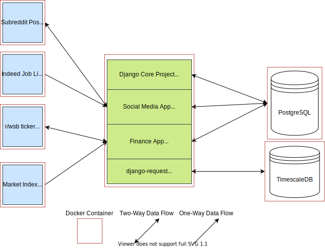

# Velkozz Web API
A Django Application that contains the API endpoints for the velkozz database built using the Django REST Framework.

The Micro Service Architecture structure of the project. Will be updated as project gets more complex:
 

# TODO:
- Dockerization fails due to issues with app.py in each app requring database to be migrated before init. This order in docker-compose needs to be sorted out. Current Akward solve is to remove app.ready() funcs and manually make migrations via docker exec after container spins up.